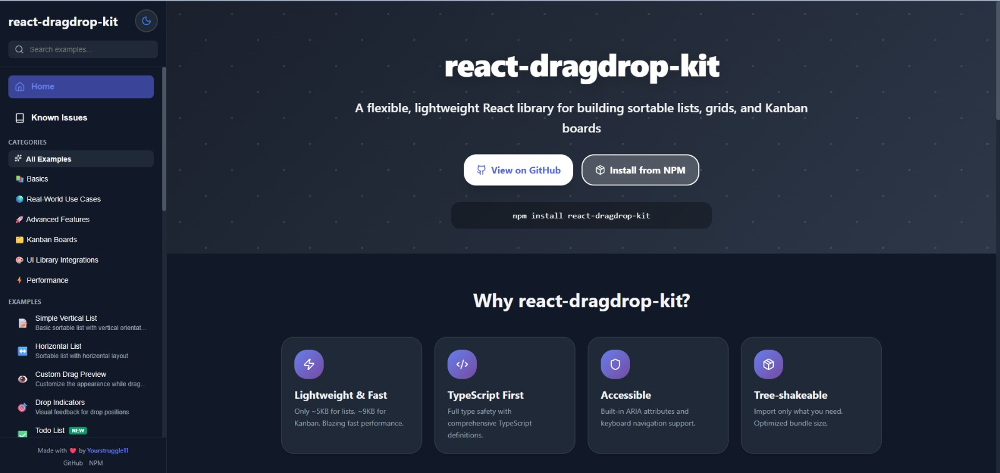

# react-dragdrop-kit Demo App



An interactive demo application showcasing the capabilities of the **react-dragdrop-kit** library with comprehensive examples.

## 🚀 Quick Start

```bash
# Install dependencies
npm install

# Start development server
npm run dev

# Build for production
npm run build

# Preview production build
npm run preview
```

The demo will be available at `http://localhost:5173`

## 📚 Examples

### Basics
- **Simple Vertical List** - Most basic vertical drag-and-drop implementation
- **Horizontal List** - Tab bar pattern with horizontal scrolling

### Real-World Use Cases
- **Todo List** - Full CRUD with priorities, filters, and sorting
- **Image Gallery** - Grid/list views with favorites and categories
- **Music Playlist** - Now playing card with playback controls
- **Form Builder** - Drag-to-build forms with live preview
- **Dashboard Widgets** - Expandable widgets with grid layout

### Advanced Features
- **Virtual Scrolling** - Performance demo with 100-2500 items
- **Multi-Selection** - Visual selection with bulk actions
- **Drag Handles** - Interactive elements within draggable items
- **Grid Layout** - Responsive grid with dynamic columns

## 🎨 Features

### Design System
- **200+ Design Tokens** - Comprehensive color, typography, and spacing system
- **Dark Mode** - Full dark/light theme support with localStorage persistence
- **Responsive** - Mobile-first design that works on all screen sizes
- **Accessible** - Built with accessibility in mind

### Developer Experience
- **TypeScript** - Full type safety throughout
- **Code Examples** - Every example includes syntax-highlighted code
- **Copy to Clipboard** - One-click code copying
- **Toast Notifications** - User-friendly feedback for actions
- **Performance Monitoring** - Real-time FPS tracking for large lists

## 📁 Project Structure

```
apps/demo/
├── src/
│   ├── components/          # Reusable UI components
│   │   ├── CodeViewer/      # Syntax-highlighted code display
│   │   ├── Sidebar/         # Navigation sidebar
│   │   ├── HomePage/        # Landing page
│   │   ├── ExampleWrapper/  # Example page layout
│   │   ├── ExampleCard/     # Example preview card
│   │   └── ...
│   ├── examples/            # Demo examples
│   │   ├── TodoList/
│   │   ├── ImageGallery/
│   │   ├── MusicPlaylist/
│   │   ├── DashboardWidgets/
│   │   └── ...
│   ├── constants/           # Design system & configuration
│   │   ├── designSystem.ts  # 200+ design tokens
│   │   └── examples.ts      # Example metadata
│   ├── contexts/            # React contexts
│   │   └── ThemeContext.tsx # Dark mode state
│   ├── hooks/               # Custom React hooks
│   │   └── useDebouncedToast.ts
│   ├── App.tsx              # Main application
│   └── main.tsx             # Entry point
└── README.md                # This file
```

## 🛠️ Tech Stack

- **React 19** - UI framework
- **TypeScript** - Type safety
- **Vite** - Build tool & dev server
- **react-dragdrop-kit** - Drag-and-drop library
- **react-syntax-highlighter** - Code highlighting
- **react-hot-toast** - Toast notifications
- **lucide-react** - Icon library

## 🎯 Design Principles

### 1. No CSS Files
All styles are defined as inline React styles using the design system. This ensures:
- Full type safety for styles
- No CSS class name conflicts
- Easy theme switching
- Portable components

### 2. Self-Contained Examples
Each example is a complete, standalone component that:
- Has its own state management
- Includes all necessary logic
- Can be copied and used elsewhere
- Demonstrates a specific pattern

### 3. Progressive Complexity
Examples are ordered from simple to complex:
- **Basics** - Learn core concepts
- **Real-World** - See practical applications
- **Advanced** - Explore advanced patterns

## 📖 Usage Patterns

### Using the Debounced Toast Hook

```typescript
import { useDebouncedToast } from './hooks/useDebouncedToast';

function MyComponent() {
  const { showToast } = useDebouncedToast();

  const handleReorder = (items, updates) => {
    setItems(items);
    showToast('Items reordered!'); // Debounced toast
  };

  return <DragDropList items={items} onReorder={handleReorder} ... />;
}
```

### Accessing Design Tokens

```typescript
import { colors, spacing, typography, borderRadius, shadows } from './constants/designSystem';

const styles = {
  padding: spacing.lg,           // 1.5rem (24px)
  background: colors.primary[500], // #667eea
  fontSize: typography.fontSize.base, // 1rem (16px)
  borderRadius: borderRadius.lg,   // 0.5rem (8px)
  boxShadow: shadows.md,           // Elevation shadow
};
```

### Using Theme Context

```typescript
import { useThemeMode } from './contexts/ThemeContext';

function MyComponent() {
  const { mode, setMode } = useThemeMode();
  const isDark = mode === 'dark';

  return (
    <div style={{
      background: isDark ? colors.gray[800] : colors.white,
      color: isDark ? colors.white : colors.gray[900],
    }}>
      Content
    </div>
  );
}
```

## 🐛 Known Issues

See the repo root [KNOWN_ISSUES.md](../../KNOWN_ISSUES.md) for a comprehensive list, or open “Known Issues” from the demo sidebar. The page in the demo renders the same content.
- Library limitations (drag handles, multi-item drag)
- Known bugs (last item reordering)
- Fixed issues
- Feature requests

## 🤝 Contributing

### Adding a New Example

1. Create a new folder in `src/examples/YourExample/`
2. Create `index.tsx` with your example component
3. Add example metadata to `src/constants/examples.ts`
4. Import and map the component in `src/App.tsx`

Example metadata:
```typescript
{
  id: 'your-example',
  title: 'Your Example',
  description: 'Brief description',
  category: 'basics', // or 'real-world', 'advanced', etc.
  difficulty: 'beginner', // or 'intermediate', 'advanced'
  tags: ['tag1', 'tag2'],
  icon: '🎯',
  featured: false,
  new: true,
}
```

### Design System Guidelines

- Always use design tokens instead of hardcoded values
- Support both dark and light modes
- Use semantic spacing scale (`spacing.xs`, `spacing.md`, etc.)
- Follow the existing color palette
- Add hover and focus states for interactive elements

### Code Style

- Use inline styles with design tokens
- Full TypeScript types for all components
- Descriptive variable names
- Extract complex logic into functions
- Add comments for non-obvious behavior

## 📦 Building for Production

```bash
# Build the demo
npm run build

# Preview the build
npm run preview
```

The build output will be in `dist/` and can be deployed to any static hosting service.

## 🔗 Related Packages

This demo uses the **react-dragdrop-kit** library from the same monorepo:
- Library source: `../../packages/react-dragdrop-kit/`
- Library docs: See the main repo README

## 📝 License

MIT - Same as the main react-dragdrop-kit package

## 🙏 Acknowledgments

- Built with [Vite](https://vitejs.dev/)
- Uses [Atlassian Pragmatic Drag and Drop](https://github.com/atlassian/pragmatic-drag-and-drop) under the hood
- Icons from [Lucide](https://lucide.dev/)
- Code highlighting by [react-syntax-highlighter](https://github.com/react-syntax-highlighter/react-syntax-highlighter)

---

**Need help?** Open an issue in the main react-dragdrop-kit repository.
