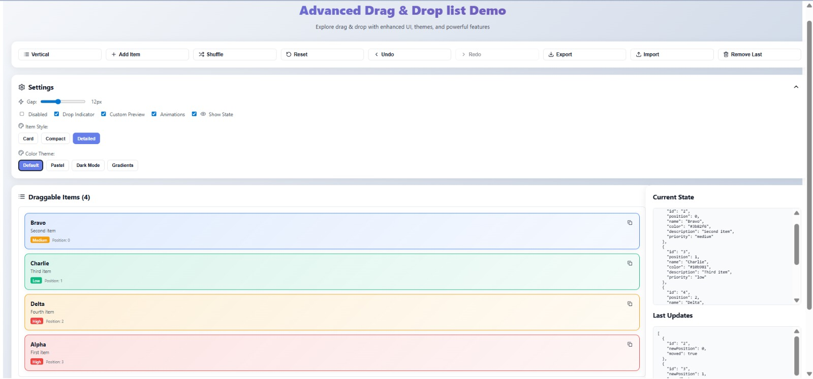

# Advanced DragDropList Demo

A feature-rich demo app showcasing **[`react-dragdrop-kit`](https://github.com/Yourstruggle11/react-dragdrop-kit)** with themes, layouts, undo/redo history, JSON import/export, and customizable item previews.



---

## ✨ Features

* **Drag & Drop list** powered by [`react-dragdrop-kit`](https://github.com/Yourstruggle11/react-dragdrop-kit)
* Multiple **item layouts** (`card`, `compact`, `detailed`)
* **Preset color themes** (default, pastel, dark, gradients)
* **Undo / Redo** with history tracking
* **Shuffle, Reset, Add, Duplicate, Remove**
* **JSON import/export** for saving/restoring item state
* Live **state inspector** panel
* Configurable:

  * Direction (`vertical` / `horizontal`)
  * Gap
  * Drop indicator
  * Custom drag preview
  * Animations toggle

---

## 🏗 Project Structure

```
src/
  App.tsx               # top-level app composition
  constants/            # themes
  types/                # item & update types
  utils/                # color + array helpers
  hooks/                # custom hooks (useItems, useHistory, useTheme)
  components/
    Toolbar.tsx
    SettingsPanel.tsx
    DragListPanel.tsx
    StatePanel.tsx
    items/              # item renderers
```

---

## 🚀 Getting Started

### 1. Install dependencies

```bash
pnpm install
# or
npm install
# or
yarn install
```

### 2. Run the dev server

```bash
npm dev
# http://localhost:5173
```

### 3. Build for production

```bash
npm build
```

---

## 🔧 Usage

This demo wraps the **`DragDropList`** component:

```tsx
import { DragDropList, type OrderUpdate } from "react-dragdrop-kit";

<DragDropList
  items={items}
  onReorder={(next: Item[], updates: OrderUpdate[]) => {
    setItems(next.map((it, idx) => ({ ...it, position: idx })));
    setLastUpdates(updates);
  }}
  direction="vertical"
  gap={12}
  disabled={false}
  showDropIndicator
  dropIndicatorClassName="demo-drop-indicator"
  dragPreviewStyle={dragPreviewStyle}
  renderItem={renderItem}
/>
```

Everything else in the demo (`Toolbar`, `SettingsPanel`, `StatePanel`) is just UI sugar around the core package.

---

## 🧪 Development Notes

* Built with **React 19 + TypeScript + Vite**
* Uses **StrictMode** in dev. If you see duplicate `onReorder` calls, that’s React double-invoking effects intentionally. Your code should be StrictMode-safe (idempotent effect cleanup).
* Styles are kept inline + a `<style>` block in `App.tsx` for simplicity. You can migrate to CSS Modules / Tailwind if you prefer.

---

## 📦 About `react-dragdrop-kit`

This demo is built to exercise all features of the core package:

* Minimal API: `items`, `onReorder`, `renderItem`
* Fully controlled: you own the array state
* Supports horizontal/vertical layouts, gaps, and custom drag preview

👉 Check the [package README](https://github.com/Yourstruggle11/react-dragdrop-kit.git) for full documentation.

---

## 📝 License

MIT © [Souvik Sen](https://github.com/your-org)
