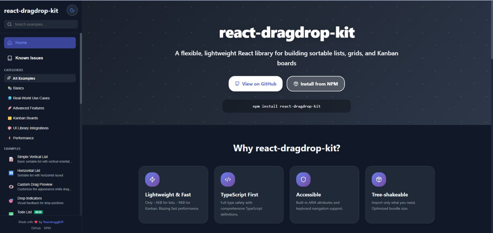

# react-dragdrop-kit Demo App



Interactive playground for `react-dragdrop-kit` list, grid, and Kanban patterns.

## Purpose

The demo is the source of truth for real usage patterns in this repo. Each example is intentionally stateful and production-oriented so behavior can be validated visually and through user interaction.

## Quick Start

```bash
npm install
npm run dev --workspace apps/demo
```

Default dev URL: `http://localhost:5173`

## Scripts

```bash
npm run dev --workspace apps/demo
npm run build --workspace apps/demo
npm run lint --workspace apps/demo
npm run preview --workspace apps/demo
```

## Example Coverage

### Basics
- `simple-vertical-list`
- `horizontal-list`
- `custom-preview`
- `drop-indicator`

### Real-World
- `todo-list`
- `image-gallery`
- `music-playlist`
- `form-builder`
- `dashboard-widgets`

### Advanced
- `virtual-scrolling`
- `multi-select`
- `drag-handle`
- `grid-view`

### Kanban
- `basic-kanban`
- `rich-kanban`
- `swimlanes-kanban`
- `wip-limits-kanban`

## Current Placeholder Backlog

- `file-tree`
- `nested-lists`
- `navigation-builder`
- `tailwind-example`
- `material-ui-example`
- `chakra-example`
- `performance-monitor`
- `optimized-large-list`

## Architecture Notes

- App shell, routing, and sidebar live in `apps/demo/src/App.tsx` and `apps/demo/src/components/`.
- Example metadata and categorization live in `apps/demo/src/constants/examples.ts`.
- The Known Issues page renders the root `KNOWN_ISSUES.md` to keep issue tracking centralized.
- Theme and notification state are provided globally from `apps/demo/src/contexts/` and `apps/demo/src/hooks/`.

## DnD Behavior Notes

- Filtered views use a merge strategy so reordering visible subsets does not drop hidden items.
- Some visual-heavy examples opt into `liveReorder` for immediate drag-over feedback.
- Native browser image dragging is disabled where it conflicts with list drag interactions.

## Local Library Testing

If you need the demo to consume local package changes before publish, point the dependency to the workspace package:

```bash
npm install --workspace apps/demo react-dragdrop-kit@file:../../packages/react-dragdrop-kit
```

Then run:

```bash
npm run build --workspace packages/react-dragdrop-kit
npm run dev --workspace apps/demo
```

## Quality Gates

Before release:

```bash
npm run lint --workspace apps/demo
npm run build --workspace apps/demo
npm run lint --workspace packages/react-dragdrop-kit
npm run test --workspace packages/react-dragdrop-kit -- --runInBand
npm run typecheck --workspace packages/react-dragdrop-kit
npm run build --workspace packages/react-dragdrop-kit
```

## References

- Root README: `README.md`
- Known issues: `KNOWN_ISSUES.md`
- Kanban docs: `docs/kanban.md`
